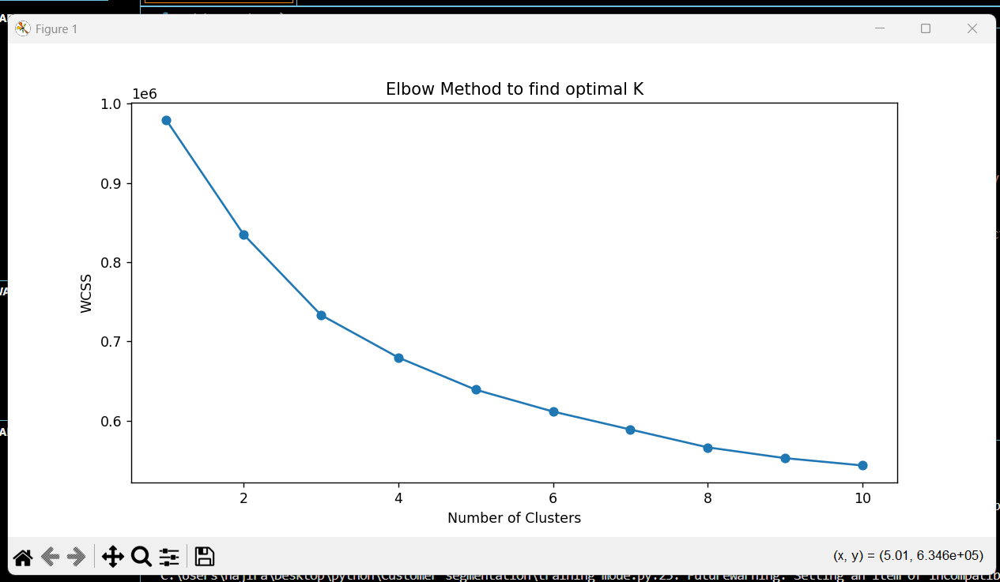
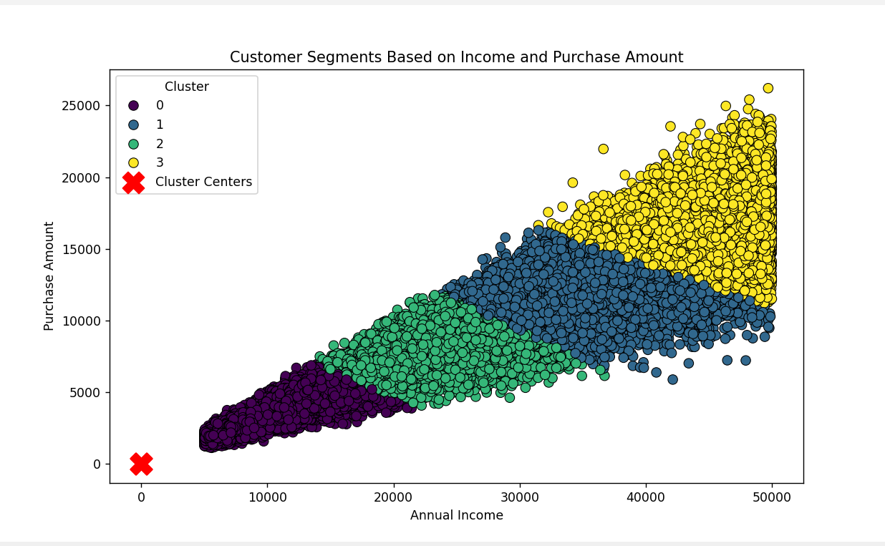
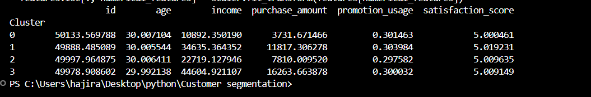

# Customer Segmentation Project

## Project Overview
This project analyzes customer purchasing behavior to create meaningful customer segments based on various features such as income, purchase amount, promotion usage, and satisfaction score. Using **K-Means Clustering**, we identify distinct customer groups to help businesses understand customer needs better and tailor marketing strategies accordingly.

### Key Objectives:
- Perform customer segmentation to identify patterns in purchasing behavior.
- Visualize the clusters to gain insights into the relationship between features.
- Use insights to guide marketing, product recommendations, and customer engagement strategies.

## Project Workflow
1. **Data Preprocessing**: Cleaned and prepared data, focusing on key features like age, income, purchase amount, promotion usage, and satisfaction score.
2. **Feature Selection**: Selected relevant features for clustering.
3. **Optimal Cluster Determination**: Used the elbow method to find the optimal number of clusters.
4. **K-Means Clustering**: Applied K-Means clustering with the chosen number of clusters.
5. **Visualization**: Created visualizations to represent clusters based on different feature pairs.

## Clustering Summary
Based on the clustering results, we identified the following customer segments:

### Cluster Descriptions:
1. **Cluster 0**:
   - **Income**: Low (approx. 10,892)
   - **Purchase Amount**: Small (approx. 3,731)
   - **Promotion Usage**: Moderate (30.1%)
   - **Satisfaction Score**: 5.0
   - **Description**: Budget-conscious or low-income customers who make smaller purchases and engage moderately with promotions.

2. **Cluster 1**:
   - **Income**: Mid-range (approx. 34,635)
   - **Purchase Amount**: Medium (approx. 11,817)
   - **Promotion Usage**: Moderate (30.4%)
   - **Satisfaction Score**: 5.0
   - **Description**: Mid-income regular buyers who have disposable income and respond to promotions.

3. **Cluster 2**:
   - **Income**: Moderate (approx. 22,719)
   - **Purchase Amount**: Moderate (approx. 7,810)
   - **Promotion Usage**: Slightly lower than others (29.8%)
   - **Satisfaction Score**: 5.0
   - **Description**: Moderate spenders who occasionally use promotions and have average satisfaction.

4. **Cluster 3**:
   - **Income**: High (approx. 44,604)
   - **Purchase Amount**: High (approx. 16,263)
   - **Promotion Usage**: Moderate (30.0%)
   - **Satisfaction Score**: 5.0
   - **Description**: High-income customers making larger purchases with consistent engagement in promotions.

## Visualizations
The following graphs illustrate the relationships between key features and the clusters identified:

### 1. Elbow Method to Find K


### 2. Customer Segments Based on Income and Spending Score


### 3. Customer Summary Output


Each visualization helps in understanding the distribution and characteristics of each customer segment. 

## Conclusion
This customer segmentation provides valuable insights into customer behavior and can assist businesses in:
- Targeting high-income customers with premium products.
- Offering promotions to budget-conscious customers to increase engagement.
- Developing personalized marketing strategies based on customer purchasing patterns.

## Technologies Used
- **Python** for data processing and analysis.
- **Pandas** for data manipulation.
- **Scikit-Learn** for implementing the K-Means algorithm.
- **Matplotlib** and **Seaborn** for data visualization.

## How to Run the Code
1. Clone this repository.
2. Install the necessary libraries:
   ```bash
   pip install pandas scikit-learn matplotlib seaborn
